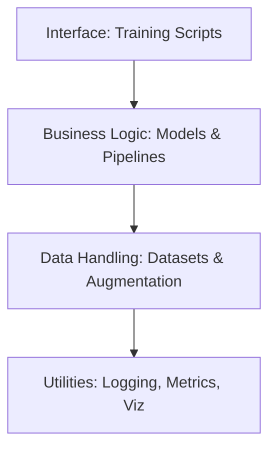

# Architecture Documentation

## Overview

The Sign Language Recognition system is designed to recognize sign language gestures from video inputs. The system employs deep learning techniques, specifically transformers combined with visual and skeleton features, to achieve high recognition accuracy.

This document describes the overall architecture, key components, and interaction between different modules of the system.

## System Architecture

The system is designed with modularity and extensibility in mind, following a layered architecture pattern:

## Key Components

### 1. Data Processing Module

The data processing module is responsible for preparing video data for model consumption:

#### 1.1 Video Preprocessing

- **Frame Extraction**: Extracts frames from videos at specified FPS
- **Spatial Processing**: Resizes, crops, and normalizes video frames
- **Temporal Processing**: Samples a fixed number of frames from each video

#### 1.2 Pose Extraction

- **Hand Keypoint Detection**: Uses MediaPipe Hands or similar to extract hand keypoints
- **Keypoint Processing**: Normalizes and processes keypoint data
- **Feature Fusion**: Prepares for fusion with visual features

#### 1.3 Data Augmentation

- **Spatial Augmentation**: Includes random crops, flips, rotations, etc.
- **Temporal Augmentation**: Includes temporal cropping, speed variation, etc.
- **Multi-modal Augmentation**: Coordinated augmentation of both video and skeleton data

### 2. Model Architecture

The model architecture follows a multi-modal approach:

#### 2.1 Feature Extraction

- **Visual Feature Extraction**: Uses pre-trained CNN (ResNet, I3D, etc.) to extract visual features
- **Skeleton Feature Processing**: Processes skeleton data into feature representations
- **Feature Fusion**: Combines visual and skeleton features for comprehensive representation

#### 2.2 Sequence Modeling

- **Transformer Encoder**: Processes the sequence of features with self-attention
- **Positional Encoding**: Adds temporal information to the sequence
- **Multi-head Attention**: Captures different aspects of the sequence

#### 2.3 Classification/Decoding

- **For Isolated Signs**: Simple classification head
- **For Continuous Signs**: Decoder with CTC loss or autoregressive decoding

### 3. Training Module

The training module handles the model training process:

- **Data Loading**: Efficiently loads and batches data
- **Optimization**: Implements learning rate scheduling, early stopping, etc.
- **Validation**: Performs periodic validation during training
- **Experiment Tracking**: Logs metrics, hyperparameters, and artifacts with wandb

### 4. Evaluation Module

The evaluation module assesses model performance:

- **Metrics Calculation**: Computes accuracy, precision, recall, F1, etc.
- **Visualization**: Generates confusion matrices, attention visualizations, etc.
- **Error Analysis**: Analyzes common error patterns

### 5. Utilities

Utility modules support various system functions:

- **Logging**: Provides comprehensive logging functionality
- **Configuration**: Manages experiment configurations
- **Visualization**: Visualizes videos, skeletons, and predictions

## Data Flow

1. **Video Input**: System accepts video files or streams
2. **Preprocessing**: Videos are processed into frame sequences, skeletons are extracted
3. **Feature Extraction**: CNN and skeleton processing extract features
4. **Transformer Processing**: Transformer processes the sequence features
5. **Classification/Decoding**: Model outputs predictions
6. **Post-processing**: Predictions are converted to human-readable format
7. **Evaluation**: System evaluates and reports performance metrics

## Multi-Platform Support

The system is designed to work across different platforms:

- **Cross-Platform Libraries**: Uses platform-agnostic libraries
- **Configuration-Based Setup**: Uses configuration files to adapt to different environments
- **Docker Support**: Provides containerization for consistent environments

## Extensibility

The architecture supports easy extension in several ways:

- **Modular Design**: Components can be replaced without affecting others
- **Configuration-Driven**: Many behaviors can be changed via configuration
- **Inheritance Patterns**: Base classes facilitate extension through inheritance

## Future Considerations

- **Real-time Processing**: Optimizations for low-latency recognition
- **Model Compression**: Techniques for deploying on resource-constrained devices
- **Transfer Learning**: Adaptation to new sign languages or vocabularies 